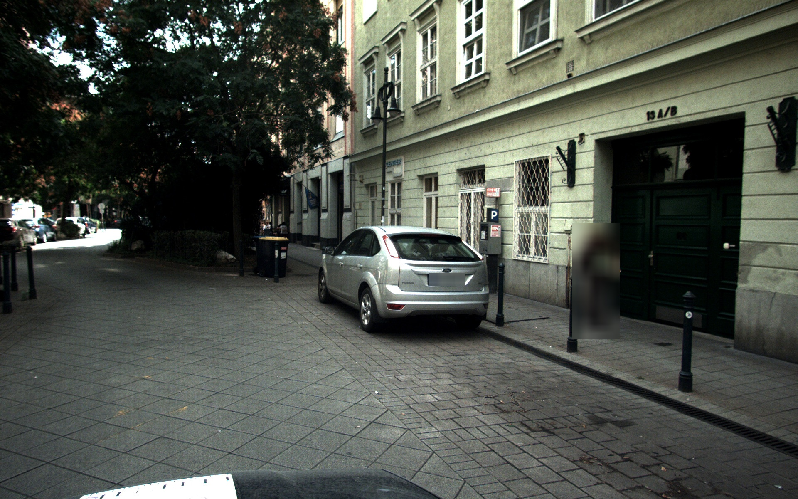
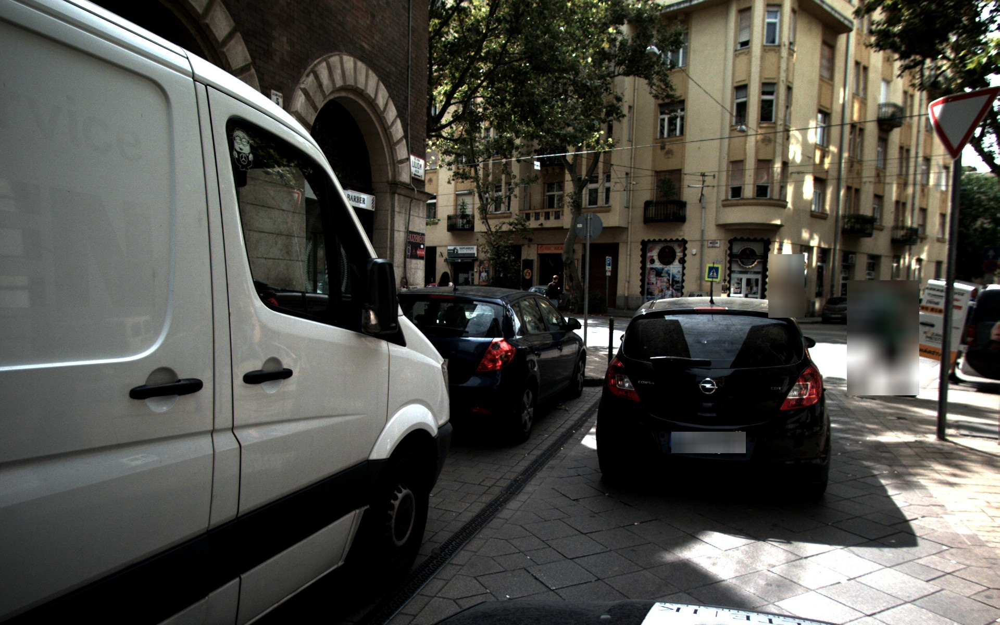
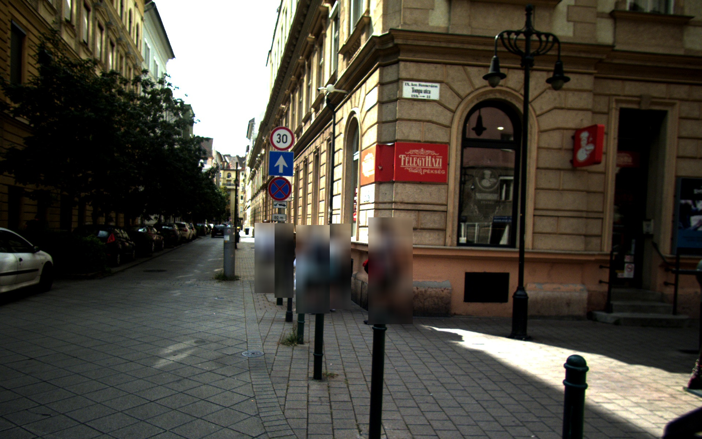
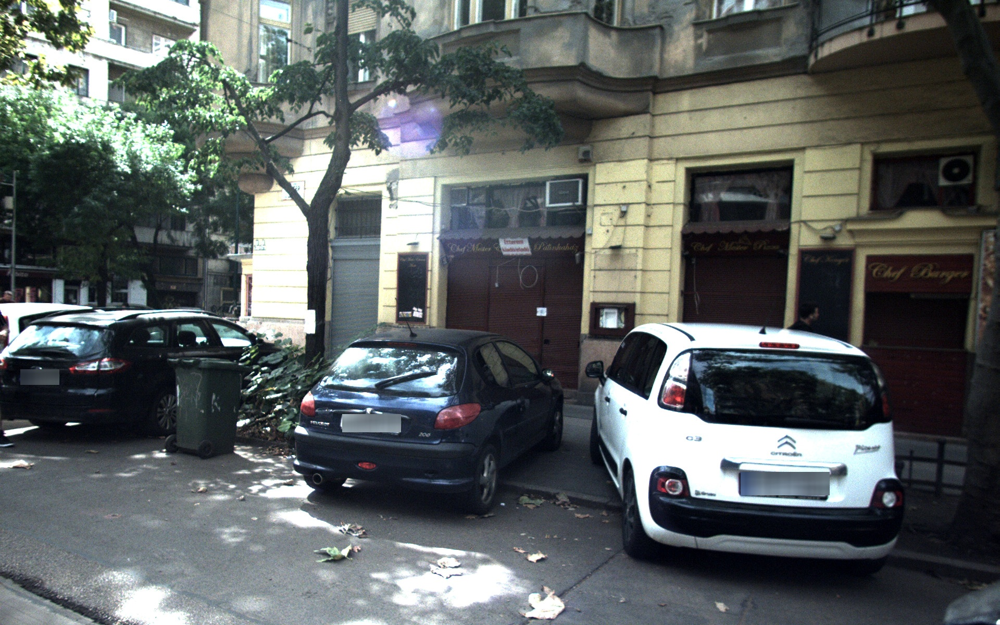

# person_and_licenceplate_blurring

## Installation:

- Python 3.9 or later
- Pytorch: On Windows, run  
  `pip3 install torch torchvision torchaudio`
- OpenCV:  
  `pip install opencv-python`
- YOLOv5:  
  In the project's folder `person_and_licenceplate_blurring`, run:  
  `pip install -U ultralytics`
- Clone YOLOv5 repository:  
  In the project's folder `person_and_licenceplate_blurring`, run:  
  `git clone https://github.com/ultralytics/yolov5`

## Usage:

1. Create a directory named `images` at the same level as the `licenseplate_test.py` file.  
2. Add the images you want to blur to this directory.  
3. Run:  
   `python licenseplate_test.py`  
   This will create an `output_images` folder with the blurred images.

## Sample Images:

Below are some example images included in the `img` folder:

### Dev0_Image_w1920_h1200_fn92.jpg

### Dev1_Image_w1920_h1200_fn262.jpg

### Dev3_Image_w1920_h1200_fn155.jpg

### Dev3_Image_w1920_h1200_fn350.jpg

